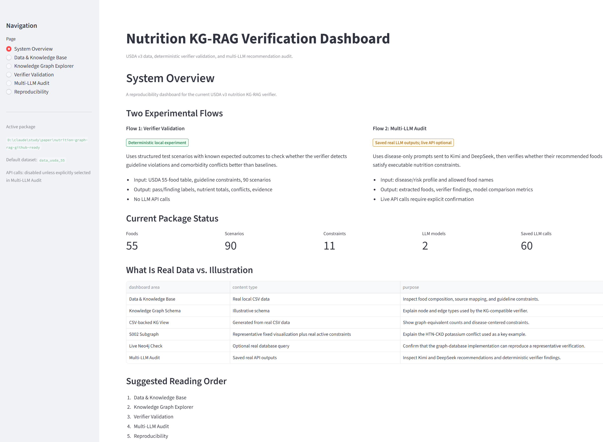
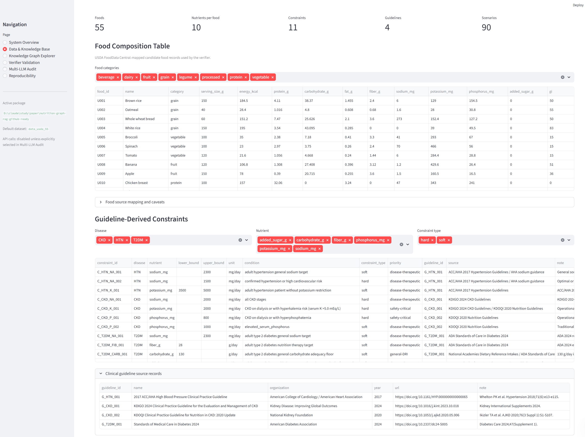
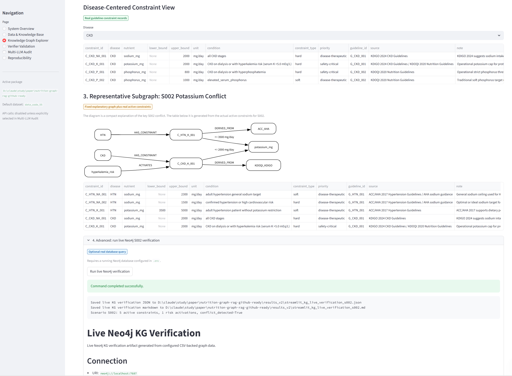
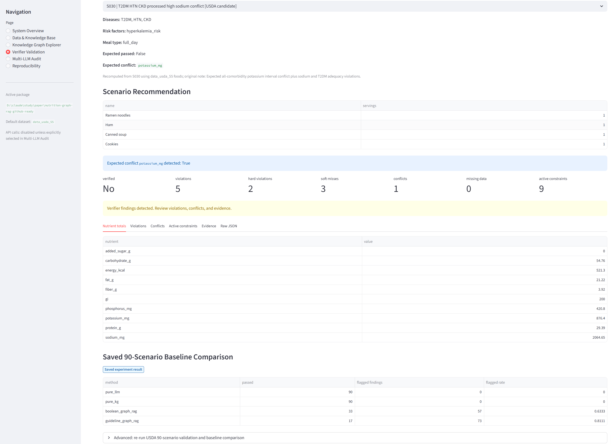
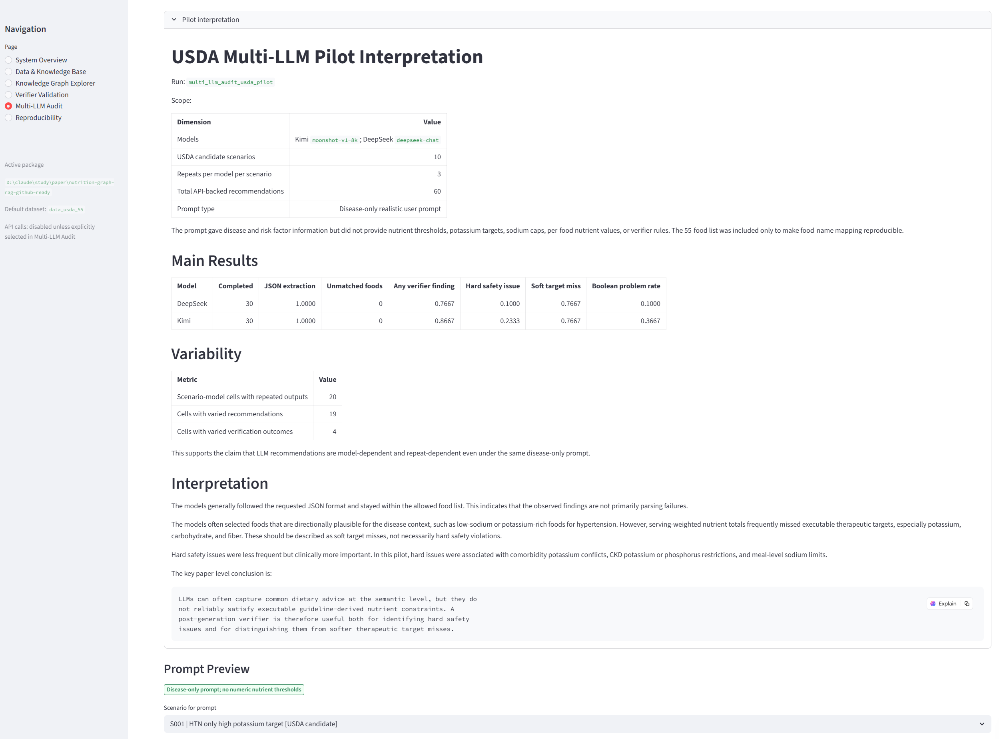
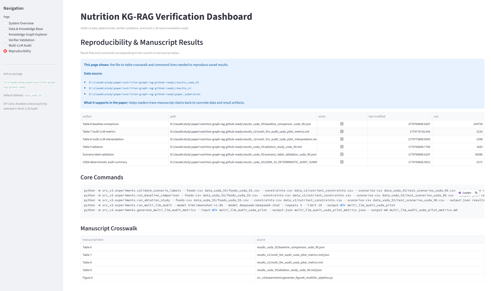

# Nutrition KG-RAG Verifier

This repository contains the reproducibility package for a nutrition knowledge-graph and guideline-based verifier for auditing LLM-generated dietary recommendations.

The current public package focuses on two workflows:

1. Deterministic verifier validation using a USDA-derived 55-food candidate dataset and 90 structured test scenarios.
2. Multi-LLM audit replay using saved Kimi and DeepSeek outputs, with optional live API re-run when API keys are configured locally.

The Streamlit app is a reproducibility dashboard. It is designed to inspect prepared data, saved experiment outputs, verifier logic, and re-run commands. It does not automatically re-run every experiment on page load. Deterministic experiments can be re-run from the command line, while live LLM and Neo4j checks require local credentials and should be launched intentionally.

## Dashboard Preview

### System Overview

The overview page summarizes the end-to-end workflow: disease-only recommendation inputs, food mapping, guideline-derived constraints, knowledge graph verification, and audit outputs.



### Data and Knowledge Base

The data page shows the USDA-derived 55-food candidate table, food source mapping, nutrient constraints, and guideline source records used by the verifier.



### Knowledge Graph Explorer

The graph explorer presents how foods, nutrients, diseases, risk factors, guideline-derived constraints, and evidence sources are connected in the executable knowledge structure.



### Verifier Validation

The verifier validation page displays the deterministic 90-scenario benchmark, including full-verifier findings, baseline comparisons, and expected comorbidity conflict detection.



### Multi-LLM Audit

The multi-LLM audit page summarizes saved Kimi and DeepSeek recommendation outputs, hard safety issues, soft target misses, parsing success, and repeated-generation variability.



### Reproducibility

The reproducibility page links the dashboard views to local data files, saved result artifacts, and command-line scripts for rerunning deterministic checks.



## Repository Structure

```text
src_v3/                  Core verifier, experiment scripts, and Streamlit dashboard
data_usda_55/            USDA-derived 55-food candidate dataset and source mapping
data_v2/                 Guideline constraints, guideline source records, and legacy small CSVs
results_usda_55/         Deterministic verifier validation results
results_v2/              Saved multi-LLM pilot outputs and metrics
docs/screenshots/        Dashboard screenshots for quick review
STREAMLIT_V3_DASHBOARD_GUIDE.md
requirements.txt
.env.example
```

Manuscript submission files are maintained locally and are intentionally excluded from this public runtime/reproducibility repository.

Large raw USDA FoodData Central downloads are not included in this GitHub-ready package. If needed, download the official USDA FoodData Central dataset separately and place it under `data_v2/dataset/`. The included `data_usda_55/` files contain the curated 55-food candidate set used by the current experiments.

## Setup

Create a Python environment, install dependencies, and run the Streamlit dashboard from the repository root:

```powershell
pip install -r requirements.txt
streamlit run src_v3\streamlit_app.py
```

For live LLM calls, copy `.env.example` to `.env` and add your own API keys. Do not commit `.env`.

```powershell
Copy-Item .env.example .env
```

Saved deterministic results and saved multi-LLM pilot results can be viewed without API keys.

## Main Reproducibility Commands

Run deterministic verifier validation:

```powershell
python -m src_v3.experiments.run_baseline_comparison --foods data_usda_55\foods_usda_55.csv --scenarios data_usda_55\test_scenarios_usda_90.csv --output results_usda_55\baseline_comparison_usda_90.json
```

Run ablation study:

```powershell
python -m src_v3.experiments.run_ablation_study --foods data_usda_55\foods_usda_55.csv --scenarios data_usda_55\test_scenarios_usda_90.csv --output results_usda_55\ablation_study_usda_90.json
```

Generate multi-LLM audit metrics from saved outputs:

```powershell
python -m src_v3.experiments.generate_multi_llm_audit_metrics --input-dir results_v2\multi_llm_audit_usda_pilot --output-prefix results_v2\multi_llm_audit_usda_pilot_metrics
```

Live multi-LLM runs require API keys and should be launched intentionally because they call external services.

Run an optional live Neo4j verification for the representative S002 scenario:

```powershell
python -m src_v3.experiments.run_kg_live_verification --scenario-id S002 --foods-csv data_usda_55\foods_usda_55.csv --constraints-csv data_v2\nutrient_constraints.csv --scenarios-csv data_usda_55\test_scenarios_usda_90.csv --output-json results_v2\kg_live_verification_s002.json --output-md results_v2\kg_live_verification_s002.md
```

This step requires a running Neo4j database and a local `.env` file with `NEO4J_URI`, `NEO4J_USER`, `NEO4J_PASSWORD`, and `NEO4J_DATABASE`.

## Data Notes

- `data_usda_55/foods_usda_55.csv` is the curated 55-food table used by the current USDA v3 workflow.
- `data_usda_55/food_source_mapping_usda_55.csv` records USDA FoodData Central source mapping.
- `data_v2/nutrient_constraints.csv` contains executable nutrient constraints.
- `data_v2/clinical_guidelines.csv` records guideline source metadata.
- Soft target misses and hard safety issues are separated in the evaluation logic.

## Dashboard

The Streamlit dashboard contains six pages:

1. System Overview
2. Data & Knowledge Base
3. Knowledge Graph Explorer
4. Verifier Validation
5. Multi-LLM Audit
6. Reproducibility

See `STREAMLIT_V3_DASHBOARD_GUIDE.md` for a manual testing walkthrough.

## Security

This GitHub-ready package intentionally excludes:

- `.env` API key files
- raw USDA downloads under `data_v2/dataset/`
- Python cache directories
- temporary dry-run and mini-pilot outputs

Before publishing, run `git status` and confirm no secret files are staged.
